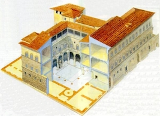

# Building the Palazzo Medici

In the mid-1440s, Cosimo de' Medici commissioned Michelozzo di Bartolomeo to design a new residence for his family in Florence, Italy.  He chose the corner of the Via Larga and Via Cavour.  Cosimo's decision to leave his ancestral home, the Casa Vecchia, is often deemed by scholars as a political tactic. The new palazzo was better suited to the powerful position Cosimo had secured in the Republic of Florence upon his return from exile in 1434.  Palaces of 15th century Florence usually consisted of multiple older homes united beneath a comprehensive façade.  This often resulted in a maze of small, dark rooms and confusing hallways.  A home built on open ground was rare in 15th century Florence.  Cosimo purchased all the building lining the corner of Via Larga and Via Cavour and razed them in order to build the Palazzo Medici from the ground up.  This allowed him to dictate the layout of the rooms on all three floors of the residence.   He was then able to determine the function and decorations within the residence, taking into account their own needs and goals for the building. The Palazzo Medici featured large rooms with uniform design and clear paths through the spaces.  Each room was designed with its function in mind.

Cosimo utilized ancient Roman architectural models to dramatize these spaces within the narrative of their residence. The purpose of using such a scheme was to present the visitor with messages and impressions about the Medici by the seemingly neutral medium of art and architecture.  How did the vicini see the Palazzo Medici?  What feelings were stirred in the common citizen when they arrived at the Palazzo Medici?  What were the cultural cues the Medici used to maintain their position of power in the Florentine Republic?
