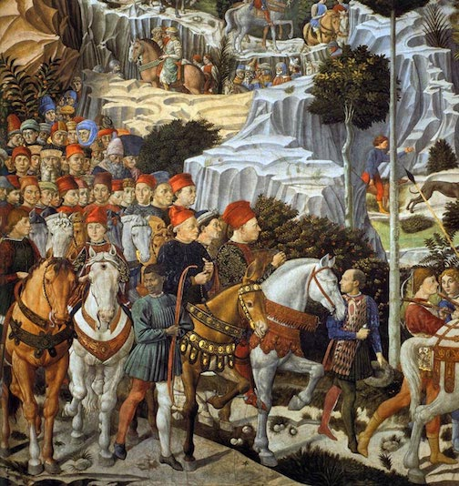

# Conclusions

The Medici surrounded their visitor with an environment that recalled the glories of a previous republic, but centered it around a statue that was a symbol for the current republic, Florence. Though never specifically denying their own power, as the presence of the fleur-de-lis on the coat of arms indicates, the courtyard hinted to a viewer that the Medici were in the service of Florence. Allegations that the Palazzo was built with misappropriated funds were hard to sustain in the face of such a suggestively patriotic space.

As citizens of Florence who had the collective power to threaten the Medici, the vicini were accorded some significance in the design and decoration of the public spaces of the Palazzo Medici. The adoption of the central courtyard, likely borrowed from the Roman domus, provided Cosimo and his family with an architectural framework that supported the patronage system necessary for their power base.  Often left to wait for extended periods of time, the most common citizens of Florence were left in a space designed specifically for them, with artwork that seemed to imply the Medici were not the figures of greed and tyranny that some had cast them to be. In all of this, it becomes clear that the Palazzo Medici was much more than a home; it was a stage upon which the Medici could and did enact their own script.  The vicini, while not privileged enough to be granted access to the rest of the Palazzo and it attendant drama, were the participants in the first scene of the Medici play, which established the Medici as citizens who sought only the best for Florence.  They built and decorated the courtyard to speak to the common citizen, to draw them into the faction of the Medici, to lure them into the conceptual reality that the Medici promoted.  
