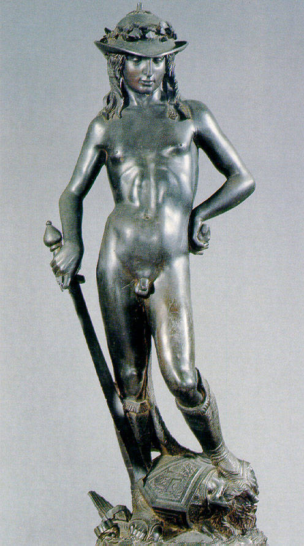

## Donatello's David

The Medici set up the courtyard to exploit the reciprocity between art and architecture and the vicini.  Within the courtyard, visitors would be seated along the extensive benches lining the walls of the space. Listed in the inventory of 1492, these benches were made of wood, with decorative panels for backing.  Facing toward the open, bright center of the space, these benches would have afforded full view of the decoration of the courtyard.  The principle object a visitor's eyes beheld there was Donatello's bronze David (Figure 1), as a statue of the youthful, nude old Testament character was raised upon a column in the center of the courtyard.  

Though David seemed contemplative and quiet, the sword clutched in his right hand introduced tension into his otherwise calm demeanor.  This is continued in the relaxed stance of the young man, who rests his left hand casually resting on his hip, while his left foots defiantly rests on the severed head of a bearded man.  A plaque mounted on the column below the David provided the viewer with a context in which to approach the statue and also delivered to him a hint as to its significance:

> “The victor is whoever defends the fatherland. God crushes the wrath of an
> enormous foe.  Behold! A boy overcame a great tyrant. Conquer, o citizens!”

For those who viewed the plaque, it refocused the narrative of David.  This inscription casts David as a tyrant-slayer, a defender of his fatherland.  The structure of the poetic lines incites the viewer, as a citizen, to celebrate the defeat of Goliath, the tyrant.  In the context of current politics, including Cosimo's return to Florence and subsequent assumption of power, the Medici's decision to install a statue of David in their courtyard came as a result of several desires. The first desire is revealed most clearly in the choice of inscription added to the plaque, where the Medici can be conflated either with the citizens or the narrator of the inscription itself.  As they rarely held official public office, the family could be considered mere citizens in Florence, equal with all others.  Though most in the city would be aware of their true position as de facto leaders of the Republic, the Medici-as­citizens conceit could have been understood as an attempt to dissociate themselves with the tyrant role in which their adversaries repeatedly cast them. Likewise, if a visitor was to place the Medici in the position of author or narrator of the inscription, the family would again appear to be separating themselves from the political drama the inscription inspires. By literally assuming the third-person narrative approach, the message of the inscription becomes that of the Medici.  In either situation, the vicini would receive the message that the Medici were understood to be on the side of the victorious David, celebrating the downfall of a tyrant. Scholars emphasize that their political opponents saw the Medici as tyrants, seizing control of the Republic for unjust purposes.  

The David was an attempt to counter the allegation of tyranny.  The statue was positioned in the center of the courtyard on a column, visible from both the ground and first floor of the palace, as well as from the street through the androne (hallway), the statue was a strong visual statement of the Medici public image.  The second desire the David fulfilled was more direct and perhaps, daring.  The Old Testament character of David was one of the many adopted symbols for the Republic of Florence. The city identified with the young man who beat a giant against all odds, seeing in his story some resonances of Florence's struggle against surrounding states such as Siena or Milan.  In 1416, the Florentine Signoria moved from the cathedral of Santa Maria del Fiore a statue of David done by Donatello in 1408 to the Palazzo Vecchio, officially initiating him as a symbol of the Republic (Figure 4).   Executed in marble, this David was a humble and chaste hero. However, he too stood in a contrapposto pose with one foot resting on the head of Goliath and bearing another illustrious inscription.   
The marble David shares little formally with the bronze David cast for the Medici. However better designed the bronze David may have been, the Medici relied on the average citizen's knowledge of the Signoria's marble David, for in the acknowledgment of the dual figures came much of their statue's implicit power and meaning (Figure 4).  

Commissioning a statue of David from the artist who first supplied the Signoria with a figure of the same theme was a form of the most direct appropriation of the icon of Florence.  In addition to the Medici as tyrant-slayers message delivered by the inscription, most informed viewers no doubt made the next logical leap that the icon was not all the Medici wanted to appropriate from the Signoria. As Ames-Lewis has rightly deduced, the bronze David could be understood as a proclamation of the shift of power in Florence from the Palazzo della Signoria to the Palazzo Medici.

The statue of David, with its rich symbolic value, took pride of place in the Palazzo Medici courtyard. To travel from the androne to the primary seating area at the north side of the courtyard a visitor would have no choice but to acknowledge the striking work. Visually, it was the defining element of the courtyard, asking for the attention of every guest with its placement and curious composition. Aware of the allegations of tyranny, the Medici used Donatello’s David and the inscription it boar, to allow the vicini to make the connections.  The polarity of the accusations and the message sent by the Medici with the statue and its inscription, were left to be resolved by the vicini.  When the two poles come together, they generate the meaning of the message.

However, a visitor who waited for the Medici as long as de' Rossi inevitably found his eyes moving past Donatello's statue to consider the space around him. In addition to effectively framing the David, the surrounding architectural and sculptural decoration gave a visitor more to contemplate during his wait.
