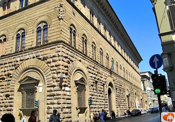

### Palazzo Medici 

The Palazzo Medici was a site of substantial political and social representation for the Medici family.  Access to much of the interior was privileged to the family.  In Florence though, visitors were an integral element in the maintenance of political faction.  Therefore, spaces of the Palazzo Medici were designed and decorated with visitants in mind.  Visitor accounts reveal that the stage was set for a special performance for each type of visitor according to the goals of the Medici.  This work will first examine previous scholarship on the Palazzo Medici.  Second, the history and the building of the palace will be outlined.  Third, the Medici’s use of Ancient Roman standards and its influence on the Florentine common citizen will be explored.  Fourth, we will look at the visitants to the palace, particularly the vicino, or common citizen, and several first hand accounts of their visits.  Finally, we will look at the courtyard of the Palazzo Medici through the eyes of the vicino, examining Donatello’s David, architectural cues, the depictions of common scenes from Ancient Rome and Greece, and the portrait busts of famous Romans.
