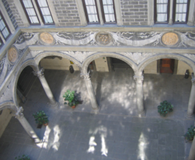

Architecturally, the courtyard was framed by a colonnade. Four columns on each side of the courtyard separated the covered walkways from the open center of the space. Above the columns were twelve roundels inset into the frieze of swags of fruit and vegetables that were sure to draw the visitor's eye. Each side of the courtyard featured three of these roundels; the middle roundel was a variation of the Medici coat of arms and a roundel on both sides of it featured narrative scenes. In total, the courtyard frieze medallions included eight figurative scenes and four sets of arms for a visitor to contemplate. The Medici coat of arms featured a shield with six balls, or palle. The shape of the shield varied over time, but the presence of the fleur-de-lis on one of the palle on each of the shields indicates that these were carved sometime after 1465, when King Louis XI of France gave the Medici permission to use the motif. Though very subtle, the addition of the fleur-de­lis to the Medici coat of arms was a visual indication of the power the family possessed. Their use in the courtyard decorative program is unique in that no other element of the decoration so explicitly referenced the current period or the state of the family's power structure.  Though the coat of arms medallions were significant and their meaning was quickly ascertained by the knowledgeable, they likely received little attention as the roundels to either side of them featured more visually dynamic narrative scenes that likely held most visitors' focus.

# Roundels

The figurative roundels depicted moments from ancient Greek and Roman mythology. Taken from a variety of stories, the scenes are united primarily through their format.  Multiple figures enact a particular moment from their individual narrative before a blank background, making the characters of each roundel the sole focus. The compositions of the scenes were taken directly from antique sources, most notably gems, cameos, and sarcophagi. Though later scholars, such as Bracker-Wester and Simon, have gone to great lengths to identify the specific scenes and posit an overall program that speaks to the Medici and their goals, the reception of the space by most visitors would likely not have been as comprehensive.  The scenes are drawn from a variety of myths:  Poseidon and Athena competing/or the dominion of Attica, Diomedes and the Palladium, Satyr with the young Dionysus, and Icarus with Pasiphae and Artemis.  The diversity of these myths makes it unlikely that the common visitor to the courtyard would be familiar with them. The average vicini was not a recipient of an elite humanist education that would allow him to identify and contemplate the specifics of each scene. What he was likely to glean from the roundels, rather, were their similarity to antique works of art he had been exposed to previously. Similar medallions were present, for instance, on the Arch of Constantine in Rome.

The presence of such roundels in the Palazzo Medici courtyard demonstrated to a viewer the Medici's interest and appreciation of antiquity. It seems to have been common knowledge at the time that several of the roundels were in fact copied from antique cameos or jewels in the possession of the Medici; these were housed in Piero's studiolo on the first floor of the Palazzo, an area off-limits to those waiting in the courtyard.  The decision to effectively enlarge and display some of the family's more precious objects in the public portion of the Palazzo was not a casual one. The Medici collection of cameos and jewels was second only to the Pope's and established the family within the emerging humanist tradition, which emphasized the study and glorification of antiquity.  These decorations connected to the overarching environment set up by the Medici to synchronize their message with the attitudes of the citizen.  The Medici's interest in Roman history and culture was also to be found in the last remaining element of the courtyard program, portrait busts.

# Busts
Though heavily adorned today with antique statuary and inscriptions, the walls of the courtyard in the quattrocento were bare and whitewashed (Figure 3). The only disruption of their blank expanses came from the stone doorframes that led from the courtyard into the functional rooms of the Palazzo.  Above each of these doorways were busts of significant Roman personages. Set within plaster niches in the shape of the Medici emblem, a diamond ring with three feathers, the antique busts of Hadrian, Agrippa, Octavian Augustus, and others presided over the courtyard.  Like the roundels of the frieze, these objects were examples of the Medici's interest in Roman antiquity.  If the wait was long, as it usually was, the vicini  would spend hours in the presence of these great Roman figures who keep watch over the Medici courtyard, and seemingly aligned with and stood for the same values as the family who placed them there.

At the time the Palazzo Medici was being decorated, Cosimo was facing the looming threat of being accused of tyranny; a portion of the citizens of Florence were convinced that the funds to build the Palazzo were being taken directly from the coffers of the Republic. The courtyard, as the most accessible public space of the Palazzo, was the ideal location to counter, or at the very least weaken, these allegations. Visitors to the space were not treated to a scene of overt wealth or power; objects in the courtyard did not include ornate paintings in gold frames, furnishings in rich textiles, or indeed, any images of the Medici at all.   Instead, the decor focused primarily on the styles and history of Rome.
