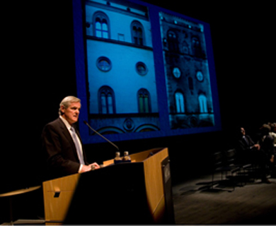
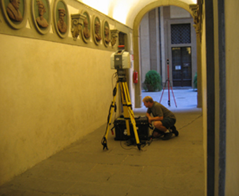

 

This is a brief description of a project undertaken by UC San Diego

#Diagnostic and Analytical Survey of Historic Building

To say that the Palazzo Medici is an historic structure is a major understatement. Completed in 1460, it housed successive generations of the powerful Medici family. It is widely considered to be the birthplace of the Renaissance. Under a Memorandum of Understanding (MoU) with the Province of Florence, CISA3 has begun a long-term project to document and analyze the Palazzo Medici. It is now a research and training venue for graduate students funded by IGERT-TEECH to work alongside the project's Principal Investigators and collaborators from Italian universities, including the University of Florence's Schools of Engineering and Architecture. They are undertaking a very detailed, high-resolution and multispectral scan of the building, from which they hope to use 3D modeling and visualization to help determine if there are art works hidden behind walls and floors. The data can also contribute to a better understanding of the way the building was constructed, how it was altered, and its current state of health. To date, CISA3 has conducted laser scans of the central courtyard, and IGERT-TEECH co-PI Maurizio Seracini has conducted thermal imaging of the façade of the Palazzo Medici to determine - via differences in heat signatures - where doors or windows might have been covered over. Indeed, recent research also revealed that the building sits on a network of underground tunnels and hidden passageways.

The first IGERT-TEECH team is there this summer (2011), and at least one Trainee - Vid Petrovic - participated in previous expeditions to study the Palazzo Medici. IGERT-TEECH Associate Jason Kimball also spent a month in Florence in 2008 compiling a very detailed terrestrial laser scan of some of the building's architectural features. Recalls IGERT-TEECH PI Falko Kuester: "Overall there seems to be a tremendous amount of excitement about the project among the people of Florence, which has given our students an interesting perspective on research. That's very exciting, but it also takes a very careful balancing act to make sure the research gets advanced at the same time the media's questions are being answered."

Early funding for this project came from the UCSD Chancellor's Interdisciplinary Collaboratories Grant, Calit2, and private donors including Bob and Natalie Englekirk, Sandra Timmons and Rick Sandstrom, Paul and Stacy Jacobs, as well as CISA3's Patrons of World Cultural Heritage (see Patrons), which continues to help fund the project along with support for graduate-student participation from NSF through the IGERT-TEECH grant.

#Background

In February 2007, Calit2 signed an MoU with the Province of Florence to embark on a research project to study and document in great detail the current state of conservation of the Palazzo Medici-Riccardi in Florence. Province President Matteo Renzi (who is currently the Mayor of Florence) attended the signing ceremony in San Diego, and the Province agreed to provide full access to the Palazzo Medici, day or night, for UCSD researcherto permit multispectral imaging of one of the most important structures of the Renaissance. Now housing the administrative offices of the Province, the nearly 600-year-old Palazzo Medici is known to have been modified many times over the centuries, and one goal of the project is to use multispectral imaging and analytical diagnostics to ascertain the various phases of renovations and additions. By scanning the entire building with modern imaging devices, long-lost murals and frescoes are likely to be located, and artifacts unearthed. CISA3 is also developing novel methods for displaying the history of the building and the results of the analytical phase of the project, thereby enhancing the Palazzo Medici's reputation as an important structure of the Renaissance and Italy's cultural heritage.
